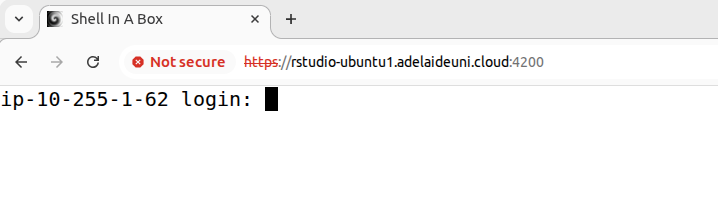
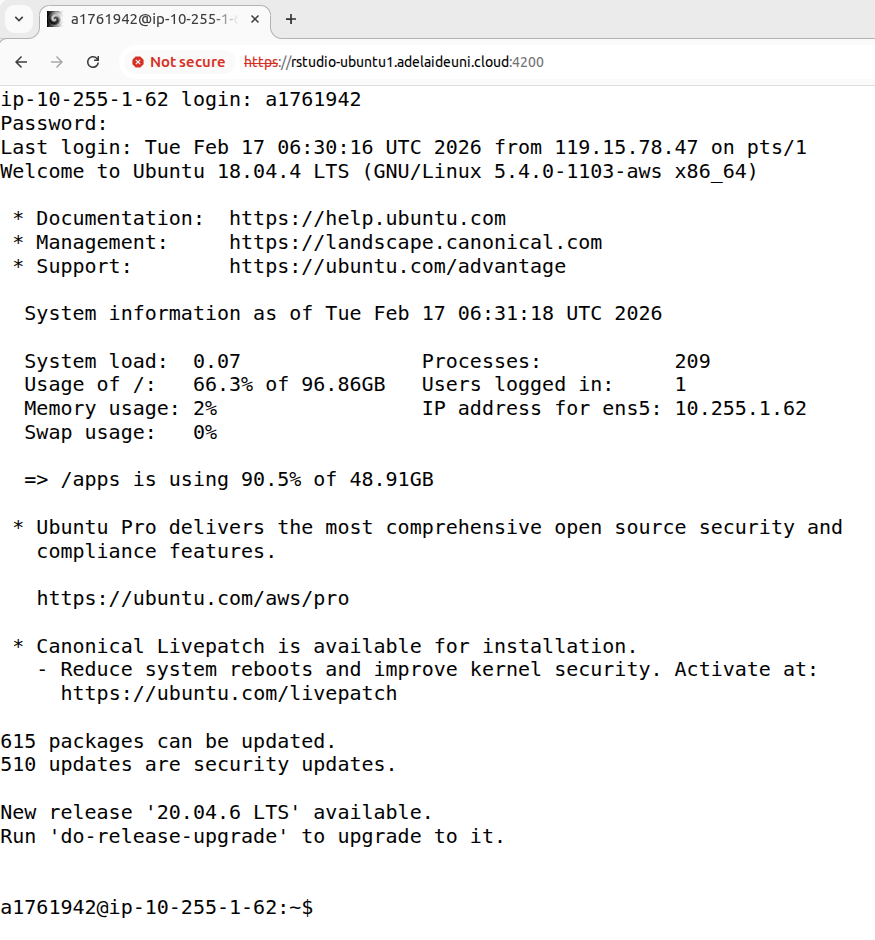
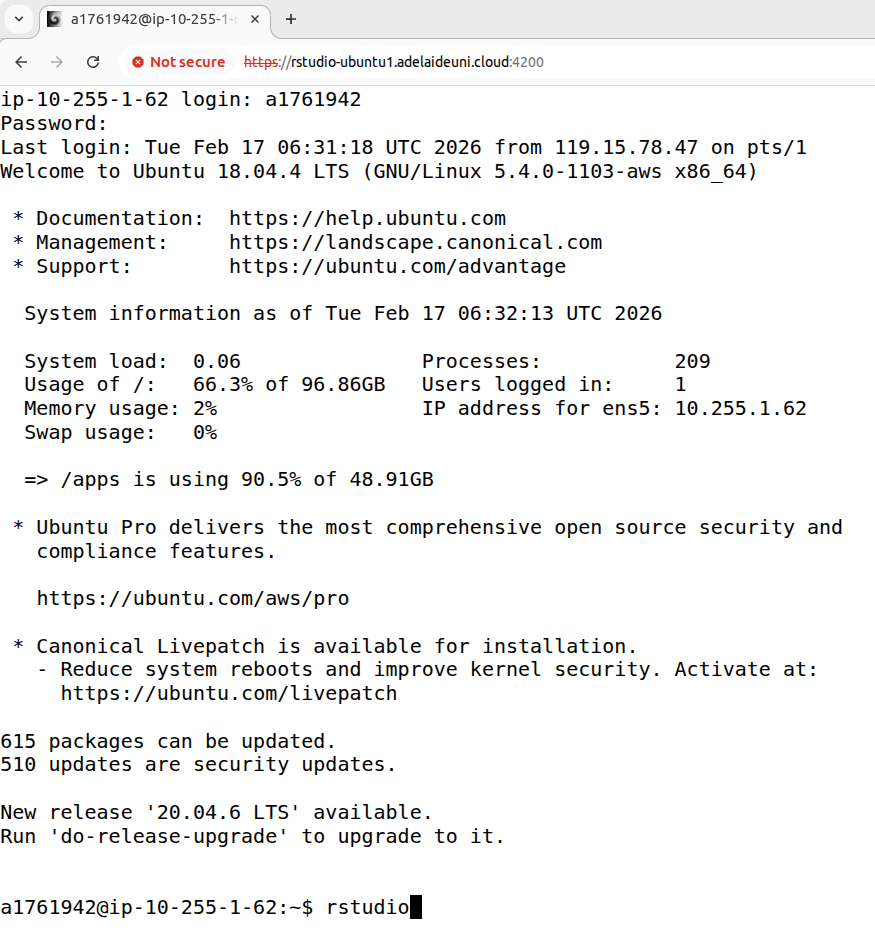
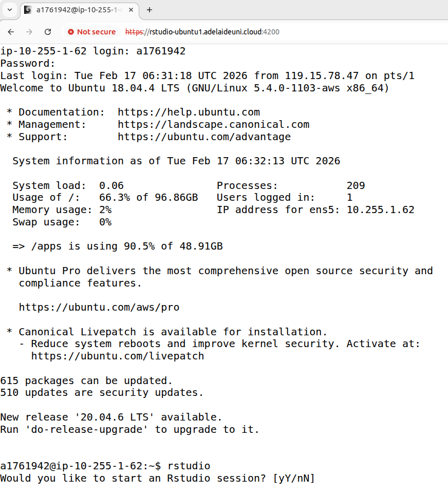
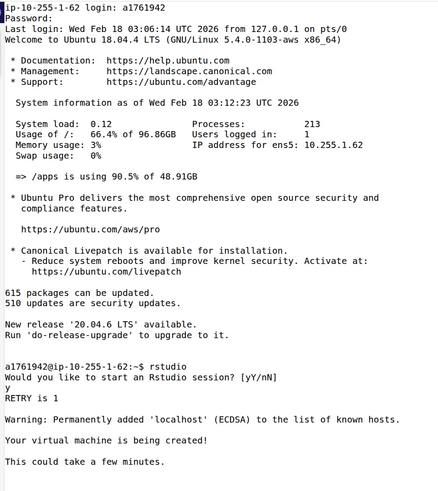
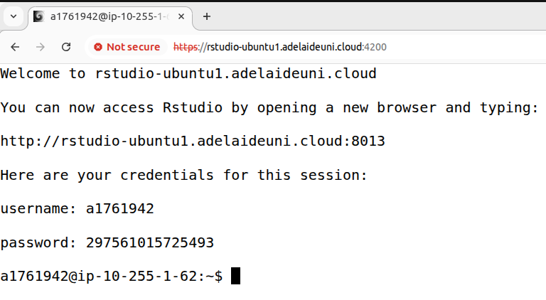
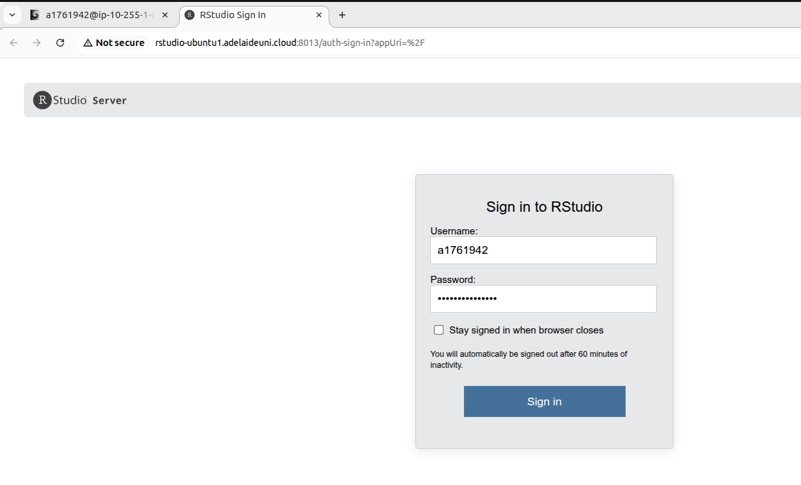

# Connecting to your Virtual Machine

You have each been given access to a virtual machine that runs in a cloud compute environment and is accessed using the IP address below.
All cloud computing accounts are private but are identical and we will use these for the entire practical series. 
Accessing your cloud compute resource is like having your very own server. 

**Follow all instructions here very, very carefully**

1. Open your favourite internet browser. We recommend Firefox, but Edge/Chrome are also acceptable. Safari has not been tested.
2. Enter your login node address (`https://rstudio-ubuntuN.adelaideuni.cloud:4200`) , where N is your login node number, in the address bar of your browser. You can ignore any warning about this being insecure. *You need to use `https` and **NOT** `http`.*
3. You should see this login screen  

    

4. Login with your Adelaide University id number (your a-number) and the password you have been assigned.

    You should see this if login is successful:

    

    **Enter `rstudio` at the prompt (it should look like this)**

    

    
    

    **Type `y` or `Y` at the prompt.**

    **Now you should see the following:** 

    

    Once the Rstudio server has been launched (this may take a couple of minutes) you should see some instructions in the browser: 

    

    __Make sure you copy the password before proceeding__

5. Open a new browser tab as instructed above and type in the URL given to you earlier, for example, (`http://rstudio-ubuntu.uoa.cloud:8001`) *for this step it is essential that you **use `http` and NOT `https`**

    you should see the following login screen. 

    

6. Use your Adelaide University id (a1234567) and paste the password that you copied in the password box. __You have two minutes to complete this__ if you don't complete in time, you have to start over. 

   Note that you may experience problems with copy/paste of the password. If you do, make sure you paste as `plain text`, if that does not work, copy the password to a plain text document, re-copy it from there and try again. 
   
    You now have access to your virtual machine! 

    - Every time you log in to your VM you will be given a new one-time password that you have to paste into the Rstudio login panel.
    - RStudio sessions automatically shut down after 3 hours, if this happens and you are still working, log in again and you can resume where you left off. This is because we pay by the minute for access to this resource. Please remember to log out of RStudio and disconnect (see below) when you are done so that we don't pay for compute resources that are not being used. 

    Importantly, because of the one-time password you will be the only person to be able to access your VM as the system has been set up to allow you to use one VM at a time.

You can access your VM:

- When connected directly to the University WiFi Network
- When connected from another network using the [Adelaide University VPN](https://www.adelaide.edu.au/technology/your-services/network-services/remote-access-via-virtual-private-network-vpn). NOTE: any issues you have with connection via VPN need to be resolved by ITDS, as we have no control over the VPN client config or your access to VPN. 

Practice how to [disconnect from your VM](vm_logout_instructions.md) and then re-connect and go back to the practical instructions. 

[Back](../Practicals/fundamentals_of_bioinformatics/prac_1_introtobash1.md)
