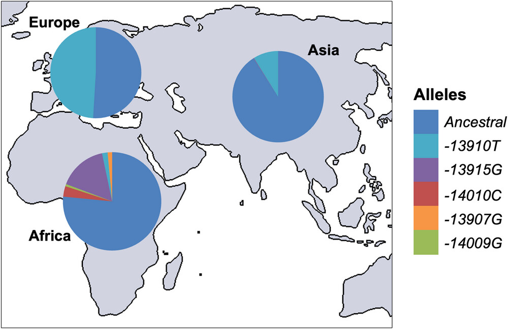
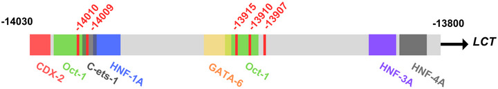
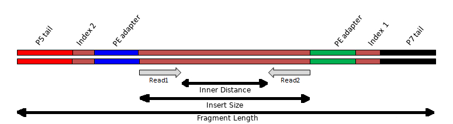

# Practical 4 - FASTQ files and Quality Control
{:.no_toc}

#### By Chelsea Matthews
{:.no_toc}

* TOC
{:toc}

# **Introduction/Background**

## Biological and genetic basis for lactose intolerance 
 
Lactose intolerance affects around 70% of adults worldwide. 
Generally, a healthy newborn baby can digest about 60–70 g of lactose per day (roughly one litre of breast milk) due to the presence of the enzyme lactase in the small intestine. 
However, after weaning, lactase expression typically declines, leading to lactose intolerance in adulthood. 
This is known as lactase non-persistence (LNP) and is the ancestral state for humans.

The lactase gene (LCT) is located on chromosome 2 and is regulated by the MCM6 locus (minichromosome maintenance complex component 6), which lies about 14 kbp upstream. 
Several single nucleotide polymorphisms (SNPs) within the MCM6 locus influence the expression of LCT. 
Certain variants create additional binding sites for transcriptional repressors, reducing the transcription of MCM6 and ultimately lowering lactase production, leading to lactose intolerance. 
Conversely, other SNPs within this region disrupt these repressor sites, allowing lactase expression to persist into adulthood.
This is known as lactase persistence (LP).

With the advent of animal domestication and dairying practices, milk became a reliable and nutrient-rich food source for many populations. 
This shift created strong selective pressure for genetic variants that allowed adults to continue producing lactase and digesting lactose — lactase persistence. 
Because this selection occurred independently in different regions and distinct genetic variants arose in separate populations. 
The distribution of the five most common variants are shown in the figure below. 
Note that all of these variants are located within intron 13 of the MCM6 gene. 



**SNPs associated with lactose persistence in different populations** from [The molecular basis of lactase persistence: Linking genetics and epigenetics](https://pmc.ncbi.nlm.nih.gov/articles/PMC12336946/)
 
We will be focusing on the Eurasian lactase persistence SNP, [rs4988235](https://asia.ensembl.org/Homo_sapiens/Phenotype/Locations?db=core;name=LACTASE%20PERSISTENCE;ph=3083;r=2:135850576-135851576;v=rs4988235;vdb=variation;vf=89657404), sometimes referred to as 13910C>T as in the figure above.
The A allele enhances activator binding which increases lactase gene expression into adulthood. 



**SNPs conferring lactase persistence**
This figure shows a schematic of MCM6 intron 13 lactase persistence enhancer region. 
The light grey represents the genomic sequence in the human reference genome GRCh38 chr2:135,850,966-135,851,196.
The coloured boxes represent transcription factor binding sites and the red lines identify the five SNPs in this region conferring lactase persistence. 
Image from [The molecular basis of lactase persistence: Linking genetics and epigenetics](https://pmc.ncbi.nlm.nih.gov/articles/PMC12336946/)


## Practical Overview

In this practical (and the next three) we will use a simple read alignment and variant calling workflow to determine the genotype of three samples at the site of the rs4988235 SNP.
We will then consider how this relates to the phenotype of lactose tolerance. 
 
The main steps in this workflow are shown in the figure below along with the file types produced by each step. 

[](https://sbc.shef.ac.uk/wrangling-genomics/04-variant_calling/index.html)

The data we will analyse with this workflow is Illumina paired-end reads from three Iberian individuals sequenced as part of the [1000 Genomes project](https://www.coriell.org/1/NHGRI/Collections/1000-Genomes-Project-Collection/1000-Genomes-Project?gad_source=1&gad_campaignid=10942056189&gbraid=0AAAAACRxwMsdRVvA7OauKN189ncoe-14z&gclid=Cj0KCQjwsPzHBhDCARIsALlWNG2QLO7P-lzVqNwqHFEiqk7yXlSRMsX5fLr86aNfAq15Xk-_8Iv5caMaAgmBEALw_wcB)  and the reference genome is a 7Mbp segment (7 million basepairs) from Chromosome 2 in the human reference genome [GRCh38.p14](https://www.ncbi.nlm.nih.gov/datasets/genome/GCF_000001405.40/). 

The first step in a bioinformatics analysis/workflow is _always_ quality control (QC) and that will be the focus for today. 
This includes checking the quality of raw data, trimming our raw data, and then re-checking quality.

## Learning Outcomes

1. Gain familiarity with high throughput sequencing data files (FASTQ reads)
2. Learn how to assess the quality of FASTQ reads
3. Learn how to perform adapter and quality trimming
4. Learn simple strategies to reduce memory/storage requirements 

# **Setup**

This practical will again be using RStudio to interact with our VM's. 
See [the first practical](../Bash_Practicals/1_IntroBash.md#rstudio) to remind yourself how to connect. 

Also, all of the code/commands in this practical should be run in the terminal pane. 

## Activate software 

The practicals use an anaconda (`conda`) software environment to provide access to the software you'll need. This is very common practice in bioinformatics. We have set up these environments already so you just need to activate them. 

For today's practical, you will need to activate the `bioinf` conda environment:

```bash
source activate bioinf
```

If this command works properly, it should produce no output. 
**If this command fails and gives you an error message** do the following:

```bash
echo -e "envs_dirs:\n- /apps/conda3/singularity/envs" > ~/.condarc

source activate bioinf
```

Everyones prompt should now have changed to look something like below:

```bash
(bioinf) a1234567@ip-10-255-0-115:/shared/a1234567$
```

The `(bioinf)` prefix lets you know you are in the `bioinf` conda environment, with access to the packages/tools installed in that environment. 
It gives us access to both of the tools (`fastqc` and `fastp`) we need for todays practical. 

## Create directory structure 

Next, we'll create a directory for todays practical and take a look at the directory structure using `tree`. 

```bash
mkdir --parents ~/Practical_alignment/{ref,0_raw,1_trim,2_align,3_variants}
tree Practical_alignment
```

It should look something like below and reflects the main steps shown in the workflow above. 

```
Practical_alignment/
├── 0_raw
├── 1_trim
├── 2_align
├── 3_variants
└── ref
```

* *In the `mkdir` command, what did the argument `--parents` do?*
* *In the same command, what was the effect of placing `ref`, `0_raw`, `1_trim` etc.  inside the curly braces?*

## Get data (with symlinks!)

The data we use and create in bioinformatics is often very large and takes up a lot of storage spaces. 
Because data storage is usually limited and is surprisingly expensive, we need to manage our data carefully.
One way we can do that is by using symlinks. 

A symlink (or 'symbolic link') is a shortcut that points to another file or folder. 
It lets you access the original file from a different location without duplicating it and thereby saves disk space.

We will create symlinks to the .fastq files for our analysis and will copy over the reference sequence. 

**Note:** Symlinks don't have to have the same name as the file they are pointing to but we will keep them the same here.  

```bash
cd Practical_alignment

## copy reference genome
cp  ~/data/intro_ngs/chr2_sub.fa ref/

## make symlinks for all .fq.gz files at once
ln -s ~/data/intro_ngs/*.fq.gz 0_raw/

tree .
```

The directory structure should now be as below. 
Notice how the reference sequence is simply listed by its name while the symlinks show the symlink n
ame, an arrow, and then the full path to the file they are pointing to.
Symlinks are also coloured differently in the Terminal.


```bash
.
├── 0_raw
│   ├── ERR3241917_1.fq.gz -> /shared//a1761942/data/intro_ngs/ERR3241917_1.fq.gz
│   ├── ERR3241917_2.fq.gz -> /shared//a1761942/data/intro_ngs/ERR3241917_2.fq.gz
│   ├── ERR3241921_1.fq.gz -> /shared//a1761942/data/intro_ngs/ERR3241921_1.fq.gz
│   ├── ERR3241921_2.fq.gz -> /shared//a1761942/data/intro_ngs/ERR3241921_2.fq.gz
│   ├── ERR3241927_1.fq.gz -> /shared//a1761942/data/intro_ngs/ERR3241927_1.fq.gz
│   └── ERR3241927_2.fq.gz -> /shared//a1761942/data/intro_ngs/ERR3241927_2.fq.gz
├── 1_trim
├── 2_align
├── 3_variants
└── ref
    └── chr2_sub.fa

```


# **Illumina Sequencing**

In order to analyse our data, we need to understand how it was generated. 
We will be analysing paired-end reads from Illumina, the most commonly used short-read sequencing platform. 
Illumina uses the [Sequencing by Synthesis](https://youtu.be/fCd6B5HRaZ8) method which you will have learned about in the course materials.
More information on Illumina sequencing is available on [their website](https://sapac.illumina.com/systems/sequencing-platforms.html).

<details>
<summary>Sequencing By Synthesis Summary</summary>
<ul>Illumina sequencing uses a sequencing-by-synthesis (SBS) approach, where fluorescently labelled nucleotides are incorporated one base at a time as DNA is copied. First, DNA fragments with special adapters are attached to a flow cell surface and amplified into clusters by bridge amplification, so each cluster represents many copies of the same DNA fragment. During sequencing, DNA polymerase adds one fluorescently labelled nucleotide to each growing strand per cycle. Each base emits a characteristic colour that is imaged by a high-resolution camera, identifying the incorporated base. The fluorescent label and blocking group are then chemically removed so the next base can be added. </ul>

<ul>This process repeats for hundreds of cycles, producing a series of colour images that are computationally converted into a sequence of bases for each cluster. The result is millions to billions of short reads that can then be aligned to a reference genome or assembled de novo for downstream analysis. Sequencing can be performed as single-end (SE), where only one end of each fragment is read, or as paired-end (PE), where both ends are sequenced, providing more information for accurate alignment and detection of structural variation.</ul>
</details>

## Indexes and things...??


The above video picks up after the process of fragmentation, as most strategies require fragments of a certain size range. This step may vary depending on your experiment, but the important concept to note during sample preparation is that the DNA insert has multiple oligonucleotide sequences ligated to either end, which together constitute the "sequencing template". 
These include **adapters**, **indexes**, and **flow-cell binding oligos** which are shown in the figure below. 
 


## Single-end (SE) and Paired-end (PE)

Illumina sequencing can return either a single read for each fragment or a pair of reads (one from either end) for each fragment. Single-end (SE) reads are often expressed with the length of the read as  "1 x 100 bp" for example while Paired-end (PE) reads would be expressed as '2 x 100 bp'. 
The first read in a pair is often referred to as the "R1" and the second read as "R2".

Paired-end reads provide:
* More bases from the insert compared to a single-end read - up to 2x as many!
* The expected distance between the reads of a pair provide additional constraints around where the read pair can/should align to a genome - the reads from a pair must align within the length of the insert which ranges from ~200-500 bp, though larger insert lengths are used for some applications
* The reads must align to the genome with the correct relative orientation. For paired-end reads this is often referred to as: forward-reverse (fr), innies or simply <span>&#8594;</span><span>&#8592;</span>


### 3' Quality Drop-Off

In general, Illumina sequencing produces highly accurate reads but read quality does tend to diminish towards the 3' end. 
During the bridge-amplification stage, millions of clusters are created on the flowcell. Each cluster comprises of 1,000-2,000 identical copies of the same template. During the process of sequencing, the polymerases attached each of the thousands of copies in a cluster "advance" one base at a time. At the start (5' end) all the polymerases are in perfect sync; generating a bright, clean, consistant light signal for detecting which base was incorporated. However, as time/number of cycles progresses, some polymerases fall behind while some race in front. The polymerases gradually get further and further out of phase with each other. This leads to dimmer and less clear signals for detection, and thus lower quality base-calls.


### PolyG artifact
Illumina uses only two fluorescent colours in its chemistry to represent the four bases. 
- C  = red
- T  = green
- A = red and green together
- G = no signal

One limitation of this system is that if the signal from a cluster becomes too weak to detect, the instrument interprets the lack of signal as a string of high confidence **G’s**, even if the real bases are different.
This tends to happen more often near the 3' end of reads. 

# **FASTQ files**

Illumina reads are stored in FASTQ files with the extension `.fq` or `.fastq`. 
These files are plain-text but are often very large so are commonly compressed using `gzip`. The `.gz` extension is added to signify this.
Most modern bioinformatics tools can read `gzip` compressed files you should keep them compressed unless you are using a tool that specifically requires them to be decompresed. 


Let's take a look at the first 4 lines in one of our FASTQ files

```bash
zcat 0_raw/ERR3241917_1.fq.gz | head -n 4
```
<details>
<summary>Code Explanation</summary>
<ul><li>'zcat' unzips the file and sends it to stdout (standard output). </li>
<li>The `|` takes standard output from `zcat` and sends it to `head`. </li>
<li>`head -n 4` takes the first 4 lines and sends them to stdout. Because there is nothing after the `head` command to send the output anywhere else, the output is printed to the terminal. </li></ul>
</details>

You should see something like below: 

```
@ERR3241917.10210 10210 length=150
GCAAATCAAAACCACTATGAGATATCTCACACCAGTTAGAATGGCAATCATTAAAAAGTCAGGAAACAACAGGTGCTGGAGAGGATGTGGAGAAATAGGAACACTTTTACACTGTTGGTGGGACTGTAAACTAGTTCAACCATTGTGGAA
+
?????????????????????????????????????????????????????????????????????????????????????????????+????????????????????????????????????????????????????????
```

The four lines are: 
 1. Read identifier, starting with the `@` symbol
 2. Sequence string
 3. A `+` symbol. The read identifier may also immediately follow but this is uncommon.
 4. Quality string

The quality string has a character for each base in the sequence string. Therefore, the length of the sequence string and the quality string should match. Quality values are numbers from `0` to `93` and are often referred to as "Phred" quality scores. To encode the quality scores as a single character, the scores are mapped to the ASCII table:

Standard ASCII Chart - Hex to Decimal code conversion
 
From https://www.commfront.com/pages/ascii-chart 

You will see that the first 33 characters (decimal values of 0-32) are all non-printable or white-space (think space, tab, backspace, bell etc). The first printable character is `!` and this has the decimal value of `33`. This character is used to represent a quality value of `0` while `"` has a decimal value of `34` and represents a quality value of `1` (`34-33`). As such these quality scores are said to be Phred+33 encoded and the quality score is simply obtained by substracting 33 from the decimal value of the character in the quality string.

If you go digging into old Illumina files, you may find quality values which are Phred+64. That is, a quality value of `0` is represented by `@` which has a decimal value of `64`. However, Phred+33 encoding is the current standard and is often referred to as Illumina 1.9. 

## Phred scores

Phred quality scores give a measure of the confidence the caller has that the sequence base is correct.
To do this, the quality scores are related to the probability of calling an incorrect base through the formula

*Q =* −10log₁₀*P*

where *P* is the probability of calling the incorrect base.
This is more easily seen in the following table:

| Phred Score | Phred+33 Encoded Character | Probability of Incorrect Base Call | Accuracy of Base Call |
|:----------- |:---------------------------|:---------------------------------- |:----------------------|
| 0           | `!`                        | 1                                  | 0%                    |
| 10          | `+`                        | 10<sup>-1</sup>                    | 90%                   |
| 20          | `5`                        | 10<sup>-2</sup>                    | 99%                   |
| 30          | `?`                        | 10<sup>-3</sup>                    | 99.9%                 |
| 40          | `I`                        | 10<sup>-4</sup>                    | 99.99%                |

* *In the read we looked at, above there were only two different characters in the quality string. Using the ascii table, what  phred scores (a number between 0 and 40) do these characters represent? Hint: These reads are Phred+33 encoded. 
* *What is the corresponding accuracy of  basecalls  with each of these phred scores?

# Quality Control with FastQC

FastQC is a very commonly used tool for assessing the quality of Illumina reads.
Let's look at the help file to see how it works.

```bash
fastqc -h | less
```

- What does the '-o' option do?
- What does the `-t` option do?

Type `q` to exit when you're finished. 

FastQC can be run from the command line or from a graphic user interface (GUI). We will be running it from the command line. 

Let's run FastQC on our reads. 

```bash
# create a directory for FastQC output files
mkdir ~/Practical_alignment/0_raw/FastQC

# Make sure you're in the right directory
cd ~/Practical_alignment

# Run fastqc on one sample
fastqc -o 0_raw/FastQC -t 2 0_raw/ERR3241917_*.fq.gz
``` 

The above command:

1. Gave both read1 and read2 for a single sample to fastqc using the wildcard `*` in the place of the value 1 or 2.
2. Specified where to write the output (`-o ~/Practical_alignment/0_raw/FastQC`) and
3. Requested two threads (`-t 2`).

What is a thread??

FastQC creates an .html report (and a zip file but we don't need that) for each file provided which can be opened from any web browser. 

Let's see what it created. 

```bash
ls -lh ~/Practical_alignment/0_raw/FastQC
```

To view the reports, use the `Files` pane to navigate to `~/Practical_alignment/0_raw/FastQC` and click on one of the html files you find (**If you don't see any html files there call a tutor**). Choose `View in Web Browser` and the file will open in your browser.

## Inspecting FastQC reports

The left hand menu contains a series of clickable links to navigate through the report, with a quick guideline about each section given as a tick, cross or exclamation mark.

Looking at the very top of the report:

1. **How many sequences are there in both files?**
2. **How long are the sequences in these files?**

Now let's look at some other parts of the report. 

#### Per Base Sequence Quality

Click on the `Per base sequence quality` hyper-link on the left of the page & you will see a boxplot of the QC score distributions for every position in the read.
These are the Phred scores we discussed earlier, and this plot is usually the first one that bioinformaticians will look at for making informed decisions about the overall quality of the data and settings for later stages of the analysis.

* *What do you notice about the quality scores as you move from the 5' to the 3' end of the reads?*
* *Do you think we might need to trim reads with poor quality 3' ends?*

#### Per Base Sequence Content

During the preparation of the sequencing library, the genome is randomly fragmented.
As such we would expect to observe relatively flat horizontal lines across this plot.
Demonstrating that we have indeed sampled fragments at random across the genome.
Depending on the GC content of the species, we might see the A and T lines tracking together but separately from the G and C lines.
It is also relatively common to see a drift towards G towards the end of a read.
This is because most modern Illumina sequencing is performed on a "2-colour" system and G is the absence of both colours.

### Overrepresented Sequences

Here we can see any sequence which are more abundant than would be expected.
Sometimes you will see sequences here that match the adapters used in the library prep. 

### Adapter Content

For whole genome shotgut sequencing library preps we expect to see little adapter content in the reads.
If there is a significant up-turn in adapter content towards the 3' end, this may indicate the genomic DNA was over-fragmented during libarary prep.
If this is significant enough, it is worth asking the sequencing service provider to redo the library prep and sequencing.

* *Do you think it will be necessary to look for and remove adapter sequences from these reads?*


# Adapter and quality trimming

The second step in quality control is trimming. 
We need to remove adapters because they don't match any part of the sequenced genome and this will make read alignment more challenging, and low quality stretches of sequence are removed as they are more likely to contain sequencing errors and therefore, may not accurately represent the sequenced genome.
Trimming can also remove some sequencing artifacts, like polyG artifacts.  
Even if the report from FastQC showed that you have good quality data with ticks for all sections, it is still best-practice to trim.

There are many tools for performing quality and adapter trimming.
We are going to be using `fastp` in this practical. The tool `trimmomatic` ([see here](https://github.com/usadellab/Trimmomatic)) would be a good alternative. 

## Fastp


(https://carpentries-lab.github.io/metagenomics-analysis/03-trimming-filtering/index.html)

When we trim reads, we usually specify a minimum length. If a trimmed read is shorter than this length, it is discarded entirely. Therefore, trimming a set of paired-end reads requires to input files (Read 1 and Read 2) and generates four output files. 

- Read 1 paired reads
- Read 2 paired reads
- Read 1 orphan reads 
- Read 2 orphan reads


Let's have a look at the help documentation. 

```bash
fastp -h
```


```bash
mkdir -p ~/Practical_alignment/1_trim/reports

time fastp \
  --thread 2 \
  -i 0_raw/ERR1949188_1.fastq.gz -I 0_raw/ERR1949188_2.fastq.gz \
  -o 1_trim/ERR1949188_1.fastq.gz \
  -O 1_trim/ERR1949188_2.fastq.gz \
  --unpaired1 1_trim/ERR1949188_1.orphans.fastq.gz \
  --unpaired2 1_trim/ERR1949188_2.orphans.fastq.gz \
  --cut_right --cut_window_size 4 --cut_mean_quality 20 \
  --length_required 75
```

## Quality Control post-trimming 

To assess how the trimming has performed, run FastQC across the paired reads output by trimmomatic and fastp.

```bash
mkdir -p ~/Practical_alignment/1_trim/FastQC

fastqc --threads 2 \
  1_trim/FastQC/ERR1949188_?.fastq.gz
```

Take a look at the various FastQC HTML report files and compare pre and post trimming plots for:

* Per base sequence quality
* Overrepresented sequences
* Adapter Content

# 


# **Building a script**


Write a script that trims and runs fastqc on the two remaining samples. 


