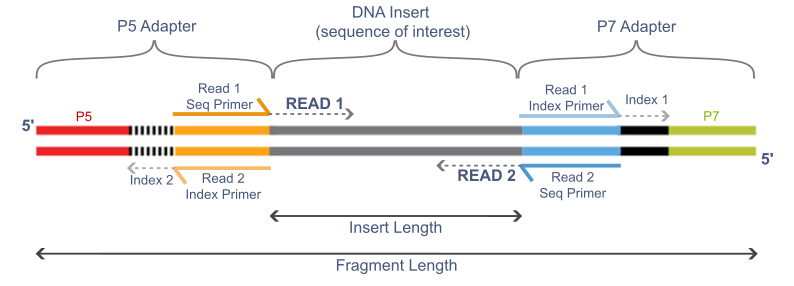
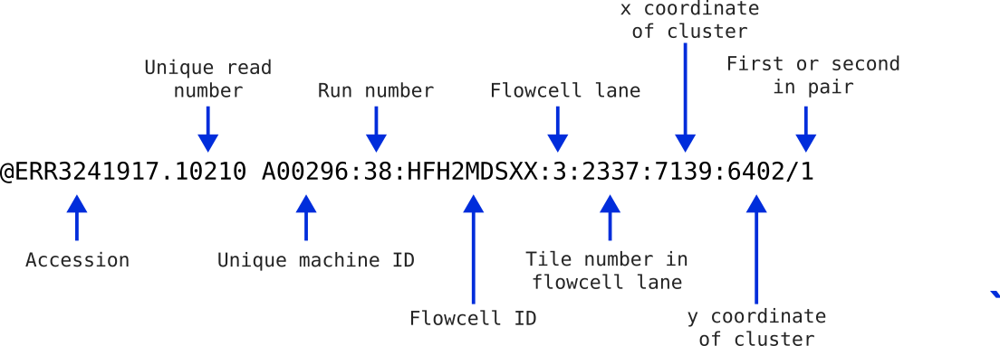

# Practical 4 - FASTQ files and Quality Control
{:.no_toc}

#### By Chelsea Matthews
{:.no_toc}

* TOC
{:toc}

# **1. Introduction/Background**

## 1.1 Biological and genetic basis for lactose intolerance 
 
Lactose intolerance affects around 70% of adults worldwide. 
Generally, a healthy newborn baby can digest about 60–70 g of lactose per day (roughly one litre of breast milk) due to the presence of the enzyme lactase in the small intestine. 
However, after weaning, lactase expression typically declines, leading to lactose intolerance in adulthood. 
This is known as lactase non-persistence (LNP) and is the ancestral state for humans.

The lactase gene (LCT) is located on chromosome 2 and is regulated by the MCM6 locus (minichromosome maintenance complex component 6), which lies about 14 kbp upstream. 
Several single nucleotide polymorphisms (SNPs) within the MCM6 locus influence the expression of LCT. 
Certain variants create additional binding sites for transcriptional repressors, reducing the transcription of MCM6 and ultimately lowering lactase production, leading to lactose intolerance. 
Conversely, other SNPs within this region disrupt these repressor sites, allowing lactase expression to persist into adulthood.
This is known as lactase persistence (LP).

With the advent of animal domestication and dairying practices, milk became a reliable and nutrient-rich food source for many populations. 
This shift created strong selective pressure for genetic variants that allowed adults to continue producing lactase and digesting lactose — lactase persistence. 
Because this selection occurred independently in different regions, distinct genetic variants conferring lactase persistence arose in separate populations. 
The distribution of the five most common variants are shown in the figure below. 
Note that all of these variants are located within intron 13 of the MCM6 gene. 


**SNPs associated with lactose persistence in different populations:** from [The molecular basis of lactase persistence: Linking genetics and epigenetics](https://pmc.ncbi.nlm.nih.gov/articles/PMC12336946/)
 
We will be focusing on the Eurasian lactase persistence SNP, [rs4988235](https://asia.ensembl.org/Homo_sapiens/Phenotype/Locations?db=core;name=LACTASE%20PERSISTENCE;ph=3083;r=2:135850576-135851576;v=rs4988235;vdb=variation;vf=89657404), sometimes referred to as 13910C>T as in the figure above.
The A allele enhances activator binding which increases lactase gene expression into adulthood. 


**SNPs conferring lactase persistence:**
This figure shows a schematic of the MCM6 intron 13 lactase persistence enhancer region. 
The light grey represents the genomic sequence in the human reference genome GRCh38 (chr2:135,850,966-135,851,196).
The coloured boxes represent transcription factor binding sites and the red lines identify the five SNPs in this region conferring lactase persistence. 
Image from [The molecular basis of lactase persistence: Linking genetics and epigenetics](https://pmc.ncbi.nlm.nih.gov/articles/PMC12336946/)


## 1.2 Practical Overview

In this practical (and the next three) we will use a read alignment and variant calling workflow to determine the genotype of three samples at the site of the rs4988235 SNP.
We will then consider how this relates to the phenotype of lactose tolerance. 
 
The main steps in this workflow are shown in the figure below along with the file types produced by each step. 

[](https://sbc.shef.ac.uk/wrangling-genomics/04-variant_calling/index.html)

The data we will analyse with this workflow includes Illumina paired-end reads from three Iberian individuals sequenced as part of the [1000 Genomes project](https://www.coriell.org/1/NHGRI/Collections/1000-Genomes-Project-Collection/1000-Genomes-Project?gad_source=1&gad_campaignid=10942056189&gbraid=0AAAAACRxwMsdRVvA7OauKN189ncoe-14z&gclid=Cj0KCQjwsPzHBhDCARIsALlWNG2QLO7P-lzVqNwqHFEiqk7yXlSRMsX5fLr86aNfAq15Xk-_8Iv5caMaAgmBEALw_wcB)  and a 7Mbp (7 million basepairs) segment of the human reference genome  [GRCh38.p14](https://www.ncbi.nlm.nih.gov/datasets/genome/GCF_000001405.40/). 

The first step in a bioinformatics analysis/workflow is _always_ quality control (QC) and that will be the focus for today and the next practical. 
This includes checking the quality of raw data, trimming our raw data, and then re-checking quality.
We have included an extra sample for the initial quality assessment so that you see reads of varying quality. 
## 1.3 Learning Outcomes

1. Gain familiarity with high throughput sequencing data files (FASTQ)
2. Learn how to assess the quality of reads in FASTQ format
3. Learn what symlinks are and why they are useful

# **2. Setup**

This practical will again be using RStudio to interact with our VM's. 
See [the first practical](../Bash_Practicals/1_IntroBash.md#rstudio) to remind yourself how to connect. 

All of the code/commands in this practical should be run in the terminal pane. 

**Please use the same filenames and paths as the practical.**
## 2.1 Activate software 

The practicals use an anaconda (`conda`) software environment to provide access to the software you'll need. This is very common practice in bioinformatics. We have set up these environments already so you just need to activate them. 

For today's practical, you will need to activate the `bioinf` conda environment:

```bash
source activate bioinf
```

If this command works properly, it should produce no output. 
**If this command fails and gives you an error message** do the following:

```bash
echo -e "envs_dirs:\n- /apps/conda3/singularity/envs" > ~/.condarc

source activate bioinf
```

Everyones prompt should now have changed to look something like below:

```bash
(bioinf) a1234567@ip-10-255-0-115:/shared/a1234567$
```

The `(bioinf)` prefix lets you know you are in the `bioinf` conda environment, with access to the packages/tools installed in that environment. 
It gives us access to both of the tools (`fastqc` and `fastp`) that we need for todays practical. 

## 2.2 Create directory structure 

Let's create a new directory for todays practical and create subdirectories that reflect the main steps in our analysis. This will help us stay organised. 

The command `tree` shows the the structure of the `Practical_alignment` directory. 

```bash
mkdir --parents ~/Practical_alignment/{ref,0_raw,1_trim,2_align,3_variants}
# Take a look at the directory structure we created. 
tree Practical_alignment
```

It should look something like below. 

```
Practical_alignment/
├── 0_raw
├── 1_trim
├── 2_align
├── 3_variants
└── ref
```

**Questions**
* In the `mkdir` command, what did the argument `--parents` do?
* In the same command, what was the effect of placing `ref`, `0_raw`, `1_trim` etc.  inside the curly braces?

## 2.3 Get data (with symlinks!)

The data associated with bioinformatics can take up a lot of storage space. 
Because data storage is usually limited and is surprisingly expensive, we need to manage our data carefully.
One way we can do that is by using symlinks. 

A symlink (or 'symbolic link') is a shortcut that points to another file or folder. 
It lets you access the original file from a different location without duplicating it and thereby saves disk space. This is a good technique if multiple people need to access the same dataset on a shared system (eg. Phoenix).

For example, the compressed fastq files we'll be using today are ~21 Mb each and there are 6 of them, totalling ~120Mb. If 60 students all copy these files to their project directories, that's over 7Gb of extra data being stored.
Therefore, we will use symlinks to access the raw fastq files for our analysis. 
We could also do this with the reference sequence but we won't today so that we can compare how these files appear in our directory. 

```bash
cd Practical_alignment

## copy reference genome
cp  ~/data/intro_ngs/chr2_sub.fa ref/

## make symlinks for all .fq.gz files at once
ln -s ~/data/intro_ngs/*.fq.gz 0_raw/

tree .
```
<details>
<summary>Tip! Naming Symlinks</summary>
Symlinks don't have to have the same name as the file they are pointing to but we keep them the same here. 
</details>

The directory structure should now be as below. 


Notice how the reference sequence is listed just by its name in black while the local symlink names are blue with an arrow pointing to the full path to the linked file in red.

In the `0_raw` directory you should have 8 files. There are two files for each sample, containing Read 1 and Read 2 respectively for a total of 4 samples. The samples starting with ERR are the Iberian samples we will be analysing with our variant calling workflow and the unknown sample is provided so that you get to see data of a different quality. 

To list just the files in the `0_raw` directory we can use `ls`. Compare the output of the two `ls` commands below and answer the questions. Don't forget about the `man` command if you need help.  

```bash
ls 0_raw

ls -lh 0_raw 
```

**Questions:**
- What is the effect of `-l` and `-h`?
- What information does the second option provide that could be useful for debugging? 

# **3. Illumina Sequencing**

In order to analyse our data, we need to understand how it was generated. 
We are analysing paired-end reads from Illumina, the most commonly used short-read sequencing platform. 
Illumina uses the [Sequencing by Synthesis](https://youtu.be/fCd6B5HRaZ8) method which you will have learned about in the course materials.
More information on Illumina sequencing is available on [their website](https://sapac.illumina.com/systems/sequencing-platforms.html).

<details>
<summary>Sequencing By Synthesis Summary</summary>
<ul>Illumina sequencing uses a sequencing-by-synthesis (SBS) approach, where fluorescently labelled nucleotides are incorporated one base at a time as DNA is copied. First, DNA fragments with special adapters are attached to a flow cell surface and amplified into clusters by bridge amplification, so each cluster represents many copies of the same DNA fragment. During sequencing, DNA polymerase adds one fluorescently labelled nucleotide to each growing strand per cycle. Each base emits a characteristic colour that is imaged by a high-resolution camera, identifying the incorporated base. The fluorescent label and blocking group are then chemically removed so the next base can be added. </ul>

<ul>This process repeats for hundreds of cycles, producing a series of colour images that are computationally converted into a sequence of bases for each cluster. The result is millions to billions of short reads that can then be aligned to a reference genome or assembled de novo for downstream analysis. Sequencing can be performed as single-end (SE), where only one end of each fragment is read, or as paired-end (PE), where both ends are sequenced, providing more information for accurate alignment and detection of structural variation.</ul>
</details>

## 3.1 Sequencing Template Components

The figure below shows the different parts of an Illumina sequencing template. 



**Question:**
- What happens if the insert length (the DNA fragment) is shorter than the read length? 

### 3.1.1Adapters

The adapters contain the sequencing primer binding sites (R1 and R2 Primers), index sequences, and the sites that allow library fragments to attach to the flow cell lawn (P5 and P7). 
There are a limited number of standard Illumina adapter sequences ([detailed here](https://knowledge.illumina.com/library-preparation/general/library-preparation-general-reference_material-list/000001314)) and so tools are often able to determine which adapter was used automatically.  
### 3.1.2 Insert

This is the fragment of DNA that we want to sequence. If we are using barcodes, the barcode is ligated directly to the DNA fragment and is included in the read (barcodes are not shown here). 
### 3.1.3 Indexes and Barcodes

Indexes and barcodes are similar in that they allow multiple samples to be pooled together in a single sequencing run and later separated by their unique sequence tags. 
This is called _multiplexing_ and separating reads by their index or barcode into individual samples is called _de-multiplexing_. 
Indexes are not included in either the forward or reverse read (indexes are shown in the figure above) and are commonly used in RNA-seq libraries. Indexed samples are generally de-multiplexed by the sequence provider. 
If barcodes are used to further multiplex samples, they will be ligated directly to the DNA insert and will be included in the read itself. 
De-multiplexing barcoded samples is not performed by the sequencing provider. 
Instead, a bioinformatician will de-multiplex using a tool like [sabre](https://github.com/najoshi/sabre). 

## 3.2 Quality - 3' Quality Drop-Off

In general, Illumina sequencing produces highly accurate reads but read quality does tend to diminish towards the 3' end. 
During the bridge-amplification stage, millions of clusters are created on the flowcell. Each cluster comprises of 1,000-2,000 identical copies of the same template. During the process of sequencing, the polymerases attached to each of the thousands of copies in a cluster "advance" one base at a time. At the start (5' end) all the polymerases are in perfect sync; generating a bright, clean, consistant light signal for detecting which base was incorporated. However, as time/number of cycles progresses, some polymerases fall behind while some race in front. The polymerases gradually get further and further out of phase with each other. This leads to dimmer and less clear signals for detection, and thus lower quality base-calls.

## 3.3 PolyG artifact
Illumina uses only two fluorescent colours in its chemistry to represent the four bases. 
- C  = red
- T  = green
- A = red and green together
- G = no signal

One limitation of this system is that if the signal from a cluster becomes too weak to detect, the instrument interprets the lack of signal as a string of high confidence **G’s**, even if the real bases are different.
This tends to happen more often near the 3' end of reads. 

# **4. FASTQ file format**

Illumina reads are stored in FASTQ files with the extension `.fq` or `.fastq`. 
These files are plain-text but are often very large so are commonly compressed using `gzip`. 
The `.gz` extension is added to signify this.
Most modern bioinformatics tools can read `gzip` compressed files and so you should keep them compressed unless you are using a tool that specifically requires them to be decompresed. 

Let's take a look at the first 8 lines in `0_raw/ERR3241917_1.fq.gz`. 

```bash
zcat 0_raw/ERR3241917_1.fq.gz | head -n 8
```
<details>
<summary>Code Explanation</summary>
<ul><li>'zcat' unzips the file and sends it to stdout (standard output). </li>
<li>The `|` takes standard output from `zcat` and sends it to `head`. </li>
<li>`head -n 8` takes the first 8 lines and sends them to stdout. Because there is nothing after the `head` command to send the output anywhere else, the output is printed to the terminal. </li></ul>
</details>

You should see something like this: 
```
@ERR3241917.10210 A00296:38:HFH2MDSXX:3:2337:7139:6402/1
GCAAATCAAAACCACTATGAGATATCTCACACCAGTTAGAATGGCAATCATTAAAAAGTCAGGAAACAACAGGTGCTGGAGAGGATGTGGAGAAATAGGAACACTTTTACACTGTTGGTGGGACTGTAAACTAGTTCAACCATTGTGGAA
+
?????????????????????????????????????????????????????????????????????????????????????????????+????????????????????????????????????????????????????????
@ERR3241917.14387 A00296:38:HFH2MDSXX:4:1413:17933:15483/1
GTGACAGTGTGAGACTCTGTCCAAAAAAAAAAAAAAAAAAAAAAAATAAAGAAAAGAAAAAAAAAAAAATAAAAAAAGGTAAATAAAAAAAAGGAAAAATAAATAAATAAAAAAAAAAATAAAAAAATAAAAAAAAAAAAACAACCCAAA
+
??????????????????????????????????????????????+???+????+??????????+??++?????++++'??+???????+???????+??++???+???+??+????+???+????'?++???+???++??++?++??

```

This shows us two reads and each read is made up of 4 lines. 
The four lines are: 
 1. Read identifier, starting with the `@` symbol
 2. Sequence string
 3. A `+` symbol. The read identifier may also immediately follow but this is uncommon.
 4. Quality string

The first and fourth line are explained more in the next few sections. 
## 4.1 Read Identifier
The read identifier line always begins with an @ symbol but may vary significantly after this depending on where the data came from (directly from the sequencing provider vs downloaded from public database). 
The figure below explains the components of the first read identifier that we saw above. If you received this data directly from Illumina, it would not contain the first two fields as this was added when the data was made publicly available. Instead it would start with the @ followed directly by the machine ID. The remaining parts of the header are fairly standard for illumina sequencing.  



This information can be helpful in identifying if any spatial effects have affected the quality of the reads. You usually won’t need most of this information, but it can be handy for times of serious data exploration.

Take a look at the beginning of the `ERR3241917_2.fq.gz`  file.   
```bash
zcat 0_raw/ERR3241917_2.fq.gz | head -n 8
```
You will notice that the information in the identifier is identical to the first file we inspected, with the exception that there is a `2` at the end. This indicates that these reads are the second in the pair of reads. The two files will have an identical structure where the order of the sequences in one is identical to the order of the sequences in the other. This way when they are read as a pair of files, they can be stepped through read-by-read.

Now have a look at one of the unknown sample fastq files to see what information the read IDs contain. 
```bash
zcat 0_raw/unknown_R1.fq.gz | head -n 16
```

Each read ID should contain: 
- the accession number of the sample (you could search for this on NCBI to find the original dataset)
- a unique read number
- read length

As you can see, the information in the identifier can vary quite a lot depending on where the data came from. 
## 4.2 Quality string

The quality string has a character for each base in the sequence string that indicates how confidently that base was called. Therefore, the length of the sequence string and the quality string should match. Quality values are numbers from `0` to `93` and are often referred to as "Phred" quality scores. To encode the quality scores as a single character (so that the sequence string and quality string are the same length), the scores are mapped to the ASCII table:

Standard ASCII Chart - Hex to Decimal code conversion
 

**Chart above from https://www.commfront.com/pages/ascii-chart**

You will see that the first 33 characters in the table (decimal values of 0-32) are all non-printable or white-space (think space, tab, backspace, bell etc). The first printable character is `!` and this has the decimal value of `33`. This character is used to represent a quality value of `0` while `"` has a decimal value of `34` and represents a quality value of `1` (`34-33`). 
As such these quality scores are said to be Phred+33 encoded and the quality score is simply obtained by substracting 33 from the decimal value of the character in the quality string. 
Quality score values usually range from 0 (!) to 40 (I) but some go a bit higher. 

If you go digging into old Illumina files, you may find quality values which are Phred+64 encoded. That is, a quality value of `0` is represented by `@` which has a decimal value of `64`. However, Phred+33 encoding is the current standard and is often referred to as Illumina 1.9. 

## 4.3 Phred scores

Phred quality scores give a measure of the confidence the caller has that the sequence base is correct.
To do this, the quality scores are related to the probability of calling an incorrect base through the formula

*Q =* −10log₁₀*P*

where *P* is the probability of calling the incorrect base.
This is more easily seen in the following table:

| Phred Score | Phred+33 Encoded Character | Probability of Incorrect Base Call | Accuracy of Base Call |
| :---------- | :------------------------- | :--------------------------------- | :-------------------- |
| 0           | `!`                        | 1                                  | 0%                    |
| 10          | `+`                        | 10<sup>-1</sup>                    | 90%                   |
| 20          | `5`                        | 10<sup>-2</sup>                    | 99%                   |
| 30          | `?`                        | 10<sup>-3</sup>                    | 99.9%                 |
| 40          | `I`                        | 10<sup>-4</sup>                    | 99.99%                |

- In the first read in `unknown_R1.fq.gz`, the quality string included the characters `A`, `!`, and `J` (as well as some others). Use the ASCII table to determine what Phred score (a number between 0 and 41) these characters represent.
- Then, use the table above to get an idea of what level of basecall confidence these numbers indicate.  
- What are the most common characters in the quality strings of reads in sample ERR3241917? What basecall accuracy do these characters indicate?

## 4.4 Quality score binning

You might have noticed that the quality scores in your Iberian sample FASTQ files don't contain a very wide range of characters. This is because quality scores are often binned to reduce filesize.  
"Binning" groups similar quality values together so that instead of storing dozens of possible Phred scores, the file only stores a smaller set of representative values. This makes FASTQ files smaller and easier to archive, with little impact on most downstream analyses. As long as the relative differences in quality are preserved, aligners and many variant callers can still perform well. However, it does mean that the quality plots you see in tools like FastQC may appear more “stepped” or uniform than expected, and very fine-grained distinctions in base accuracy are not captured
# **5. Quality Control**

Now that we know what our data looks like (FASTQ files), we can start Quality Control (QC). 

QC generally consists of 3 steps:
1. Check quality of raw data
2. Trim and clean data
3. Check quality of trimmed data

We will be using FastQC to check the quality of our raw and trimmed data and `fastp` to do the trimming. 
Both of these tools are very commonly used for quality control with Illumina reads.

Let's look at the help file for FastQC to see how it works.

```bash
fastqc -h | less
```

- What does the `-o` option do?
- What does the `-t` option do?
- Is there any difference between the `-o` and `--outdir` options?
- Look at the SYNOPSIS section at the top of the help documentation. This tells us what `fastqc` is expecting our command structure to look like. Compare it with the `fastqc` command we are going to run below to see how it works.   

Type `q` to exit when you're finished. 

Let's run FastQC on our unknown sample.  

```bash
# create a directory for FastQC output files
mkdir -p ~/Practical_alignment/0_raw/FastQC

# Make sure you're in the right directory
cd ~/Practical_alignment

# Run fastqc
fastqc -o 0_raw/FastQC/ -t 2 0_raw/unknown_R*.fq.gz
``` 

The above command:

1. Gave both read1 and read2 for the "unknown" sample to fastqc using the wildcard `*` in the place of the value 1 or 2.
2. Specified where to write the output (`-o ~/Practical_alignment/0_raw/FastQC`) and
3. Requested two threads (`-t 2`).

<details>
<summary>What are threads?</summary>
<ul>In a multi-threaded process, a big job is split into many smaller jobs that are then run at the same time (in parallel) which gets the job done a lot faster.</ul> 

<ul>Let's use an analogy. If you were asked to plant 100 trees and it took you a minute per tree, it would take you 100 minutes to plant all of the trees.
But if you and three friends were doing the job together, it would only take 25 minutes because each person would plant 25 trees and you could all work at the same time.
These examples are analogous to a single-threaded process and a multi-threaded process in computing.</ul>

<ul>While this is really useful, keep in mind that not all proceses can be split up in this way because the steps necessary to complete these processes are sequential.</ul>

<ul>Your VMs can run two parallel processes (2 threads) but the University High Performance Computer (HPC) Phoenix can run over 70.
You can tell if a tool can use multiple threads by looking at the documentation.</ul>

</details>

FastQC creates an .html report (and a zip file but we don't need that) for each file provided which can be opened in a web browser. 

To view the reports, use the `Files` pane to navigate to `~/Practical_alignment/0_raw/FastQC` and open both of the html files you find (**If you don't see any html files call a tutor**). Click on a file and then choose `View in Web Browser` and the file will open in your browser.

## 5.1 FastQC Reports
### 5.1.1 FastQC basic statistics

Let's look at the FastQC reports for our Unknown sample. **These reads are paired-end RNA-seq.**

Using the Basic Statistics information at the top of the FastQC reports, answer the following questions:

- How many reads are in each of the two "unknown" FASTQ files? 
- How many read pairs are there?
- How long are the reads?
- What is the approximate GC content?
- How many Mbp of sequence information is there across both files?

The left hand menu contains a series of clickable links to navigate through the report, with a quick guideline about each section given as a tick, cross or exclamation mark.

Let's look at some other parts of the report. 

### 5.1.2 Per Base Sequence Quality

Click on the `Per base sequence quality` hyper-link on the left of the page & you will see a boxplot of the QC score distributions for every position in the read.
These are produced from the Phred scores we discussed earlier, and this plot is usually the first one that bioinformaticians will look at for making informed decisions about the overall quality of the data and settings for later stages of the analysis.
The red dashed line indicates the maximum quality score at that position in the read and the blue line indicates the average quality score at that position. 

* What do you notice about the quality scores as you move from the 5' to the 3' end of the reads?  Can you explain why this is the case? 
* Are R1 or R2 reads higher quality? Can you explain why this is the case? 

### 5.1.3 Per Base Sequence Content

In a WGS experiment where DNA is randomly fragmented, we would expect to see relatively flat horizontal lines across this plot. 
Depending on the GC content of the species, we might see the A and T lines tracking together but separately from the G and C lines.
RNA-Seq data will usually fail this section because the "random" hexamer priming used in RNA-seq library preparation is not truly random. Additionally, this plot may also show artefacts from barcode sequences or adapters early in the reads before stabilising.
It is also relatively common to see a drift towards G towards the end of a read.
This is because most modern Illumina sequencing is performed on a "2-colour" system and G is the absence of both colours. 

### 5.1.4 Per Sequence GC content
This plot gives the GC distribution of all sequences. The line should be normal(ish) for whole genome sequencing but sharp peaks are not unusual in RNA-Seq indicating highly-expressed sequences. The peak of the curve should align with the expected GC content of the species. 

### 5.1.5 Sequence Length Distribution
The distributions of sequence lengths in our data. Here we have sequences that are all the same lengths, however if the length of your reads is vital (e.g. smallRNA data), then this can plot can be informative.

### 5.1.6 Sequence Duplication Levels
This plot shows about what you’d expect from a typical NGS experiment. There are few to no duplicated sequences and lots of unique sequences representing the diverse transcriptome. This is only calculated on a small sample of the library for computational efficiency and is just to give a rough guide if anything unusual stands out.
### 5.1.7 Overrepresented Sequences
Here we can see any sequence which are more abundant than would be expected.
A normal high-throughput library will contain a diverse set of sequences but sometimes we find that some sequences are more common than we would expect. 
This can be for a range of reasons. 
It could mean that a sequence is highly biologically significant (ie. in RNA-seq), indicate that the library is contaminated, or it could be the result of a sequencing artifact. 
Sometimes you will also see sequences here that match the adapters used in the library prep. 

### 5.1.8 Adapter Content

For whole genome shotgun sequencing library preps we expect to see little adapter content in the reads.
If there is a significant up-turn in adapter content towards the 3' end, this may indicate the genomic DNA was over-fragmented during library prep.

**Questions:**
Remembering that the Unknown sample is RNA-seq, answer the following:
- Should we be worried about the Per base sequence content plot? Why?
- What about the Per sequence GC content plot? 
- What could be the cause of the overrepresented sequences?

## 5.2 Example FastQC report
[This](https://www.bioinformatics.babraham.ac.uk/projects/fastqc/bad_sequence_fastqc.html) is a FastQC report of poor quality reads. Look through the report and read the notes below.

**Per Base Sequence Quality** - Looking at the first plot, we can clearly see this data is not as high quality as the one we have been exploring ourselves.

**Per Tile Sequence Quality** - Some physical artefacts are visible and some tiles seem to be consistently lower quality. Whichever approach we take to cleaning the data will more than likely account for any of these artefacts. Sometimes it's just helpful to know where a problem has arisen.

**Overrepresented Sequences** - There seem to be a lot of enriched sequences of unknown origin. There is one hit to an Illumina adapter sequence, so we know at least one of the contaminants in the data. Note that some of these sequences are the same as others on the list, just shifted one or two base pairs. A possible source of this may have been non-random fragmentation.

Interpreting these reports can take time and experience. Descriptions of each of the sections are provided [here](https://www.bioinformatics.babraham.ac.uk/projects/fastqc/Help/) by the FastQC authors. 

# **In-Class Exercise**
Run `fastqc` on the sample ERR3241917 and look through the FastQC reports to answer the following questions.

```bash
fastqc -o 0_raw/FastQC -t 2 0_raw/ERR3241917_*.fq.gz
```


- What is the GC content of ERR3241917?
 - How many Mbp of sequence have you got in total for ERR3241917?
- Coverage (x or fold) is a measure of how many times you would expect each base in the genome to be covered by an aligned base after aligning all the reads. It is the total number of bases in your reads divided by the genome size. If these reads from a 7Mbp genome (7 Million basepairs), how many fold coverage do you have?
 - You should see an additional plot called "Per tile sequence quality" that was not present in the Unknown sample report. It will look like a big blue square. What information does this plot give us and when might it be useful?
 - FastQC automatically assigns a tick, cross, or exclamation mark to each plot. Do you think you can rely on this to tell you if there's a problem with your data?

Now run `fastqc` on your two other human samples and check their reports. 
- ERR3241921
- ERR3241927

In the next practical, we'll finish quality control by trimming our data and then re-assessing data quality. 
