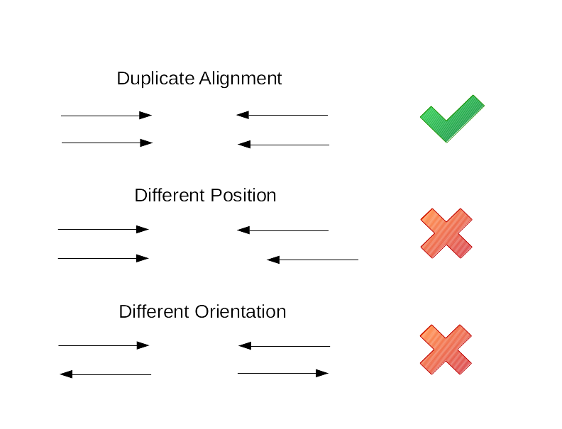

# Practical 7 - Variant Calling
{:.no_toc}

#### By Chelsea Matthews
{:.no_toc}

* TOC
{:toc}

# Introduction
In the last three practicals we performed quality control on Illumina reads and then aligned our reads to the reference genome. We also visualised our alignments with IGV and saw examples of homozygous and herozygous SNPs. 
We are now up to the final step in our analysis - variant calling.  
In the context of the biological question we are investigating, this is the step where we find the genotype of our three Iberian samples at the location of the Eurasian lactase persistence SNP, rs4988235 (also called 13910C>T) and from this, we will be able to predict whether or not these people are lactose tolerant. 


[](https://sbc.shef.ac.uk/wrangling-genomics/04-variant_calling/index.html)

## Overview of today

While sequence alignment is potentially the most important aspect of most high-throughput sequencing pipelines, in whole genome sequencing (WGS) experiments, such as we are simulating here, it is crucial to not only identify where reads have mapped, but regions in which they differ. These regions are called "sequence variants", and can take many forms. Three major types of sequence variation include:

1. Single Nucleotide Polymorphisms or Variants (SNPs/SNVs): single-base pair changes. e.g. A->G
2. Insertion-Deletions (InDels): An insertion or deletion of a region of genomic DNA. e.g. AATA->A
3. Structural Variants: These are large segments of the genome that have been inserted, deleted, rearranged or inverted within the genome.

We are working with short reads and will be focusing on SNPs and InDels. 

## Learning Outcomes

1. Learn about different types of duplicates and how to handle them
2. Learn how to call variants to produce a VCF
3. Learn about the VCF format and how to interpret it

## Setup and catchup

Let's activate our software!

```bash
source activate bioinf
```

**If you didn't complete the last practical**, you may not have the necessary files. The code below will copy these files from the /data directory to your `~/Practical_alignment` directory.  

```bash
# only run this block of code if you DID NOT complete the last practical

# make sure the correct directories exist
mkdir --parents ~/Practical_alignment/{ref,2_align,3_variants}
mkdir --parents ~/Practical_alignment/2_align/bam

cd ~/Practical_alignment

# copy over the reference genome if it's not there already
cp --no-clobber ~/data/intro_ngs/chr2_sub.fa ref/
# index the reference genome
bwa index ref/chr2_sub.fa 

# copy all bam files over
cp ~/data/intro_ngs/bams/* ~/Practical_alignment/2_align/bam/.

```
# **Mark duplicates**

The next step in a variant calling workflow is marking duplicates. But what are duplicates? 
###### PCR duplicates
During some sequencing processes (in traditional Illumina sequencing), DNA or cDNA fragments are amplified in a Polymerase Chain Reaction (PCR) using specific adapters and primers.
If the initial unique targets are saturated during this process, then replicated fragments may be amplified, leading to what we refer to as "Library Duplicates" or "PCR Duplicates".
###### Optical duplicates
If a single cluster on the Illumina flowcell is imaged as two or more clusters, we will get two or more reads from the same cluster called Optical duplicates. 
###### How do we identify them?
With the exception of any sequencing errors, duplicate reads will be identical and will therefore map to the exact same position, like in the figure below.  Therefore, if alignments are sorted by coordinates, any duplicated reads should be next to each other. 
For every set of duplicates identified, we keep the read (or read pair for paired end reads) with the highest base quality as the original read and mark the others as DUP. 

 

Optionally, `samtools markdups` can also compare the read groups and barcodes of duplicated reads. If two or more reads appear to be duplicates based on their alignment but have different read groups or barcodes, then they will not be marked as duplicates.  

###### When don't we mark duplicates?
Duplicate detection as noted above works well for paired-end reads but not as well for single-end reads. 
Additionally, count-based sequencing approaches such as ChIP-seq and RNA-seq are generally prone to having high-coverage areas (especially if you have deep sequencing) which may look like duplicates.
Some small non-coding RNAs are also short, so its very likely to have similar alignment starts and ends.
And if you have an experiment that involves a low initial input of DNA or RNA, you're likely to get a high level of PCR duplicates anyway!
In these cases, we might choose not to mark duplicates at all or we might run our analysis both with and without marking duplicates and compare our results. 

For the data we're working with, it makes sense to mark duplicates. 

## Mark duplicates with samtools

The tool we'll use to mark duplicates is `samtools markdup` but it requires BAM files to be formatted so that:
- Mate cigar strings and mate quality score tags must be present. We can add these with `samtools fixmate`
- sorted by coordinates

Therefore, to mark duplicates we need to do the following:
1. `samtools sort` by sample name (required for step 2)
2. `samtools fixmate` to add mate cigar strings (MC) and mate quality score (ms) tags to the BAM file 
3. `samtools sort` by coordinates
4. `samtools markdup` to mark duplicates

```bash
samtools sort -n -O bam 2_align/bam/ERR3241917_sorted.bam | samtools fixmate -m -O bam - - | samtools sort -O bam - | samtools markdup - 2_align/bam/ERR3241917_markdups.bam
```

Run the code above for all three samples (ERR3241917 ERR3241921 ERR3241927). 
It may take a few minutes.   

The information added by markdups is in the last few columns of the BAM file. Take a look using `less`. 
```bash
# use less to view alignments after marking duplicates
samtools view 2_align/bam/ERR3241917_markdups.bam | less
```

You should see that most alignments have a few extra columns of information beginning with the tags `MQ`,  `MC`, and `ms` but not all. This is because these columns contain information about the mate of the read described by an alignment. If a read didn't align as part of a proper pair, this information isn't calculated or added.  

# **Variant Calling**

Variant callers work by counting all reference and alternative alleles at every individual site on the reference genome. 
Because there will be two alleles (e.g. A and B) for each individual reference base (assuming the organism that you are sampling is diploid), then there will be sites which are all reference (AA) or alternate (BB) alleles, which we call a homozygous site. 
If the number of sites is close to 50/50 reference and alternate alleles (AB), we have a heterozygous site. 
We saw examples of homozygous and heterozygous sites in the IGV visualisation and these are the types of features that variant calling algorithms detect. 

There are many variant calling algorithms, which all have advantages and disadvantages in terms of selectivity and sensitivity. 
Many algorithms aim to detect *regions* of the genome where many variants have been called, rather than individual sites, and thus are called *haplotype callers*. 

## What is a VCF?
The standard output of a variant caller is a *variant call format* (VCF) file, a tab-separated file which details information about every sequence variant within the alignment. For information on the VCF file specification see [here](https://samtools.github.io/hts-specs/). The VCF file specification is continuously evolving and is regulated by the [Global Alliance for Genomics & Health](https://www.ga4gh.org/#/fileformats-team).

The VCF file contains everything that you need to know about the sequence variant including its location (chromosome and position), the reference and alternate alleles, the variant quality score and the genotype code (e.g. 0/0, 1/1, 0/1). 
Additionally, the VCF file can be annotated to include information on the region in which a variant was found, such as gene information, whether the variant had an ID (from major databases such as NCBI's dbSNP for example) or whether the variant changed an amino-acid codon or not (synonymous vs non-synonymous sequence variants).

## Interpreting VCF files

Try and answer the following questions with reference to the example VCF below. The [Overview of file types](./../../../Course_materials/overview_of_file_types.md) document includes a section on VCFs that may help. 

As a quick overview:
- lines beginning with `##` contain meta-information
- the line beginning with `#` contains column names
- all remaining lines are the main contents of the VCF (the variants we called)

**Questions:**
- What information is in the first 5 columns?
- On which chromosome and at what position is the first variant in the VCF located?
- What is the reference allele for this variant?
- What is the alternate allele for this variant?
- What are the names of the three samples in the VCF?
- What does it mean when there are two values in the ALT column separated by a comma?
- What does the "GT" tag in the FORMAT column stand for and where can we find this information for our samples?
- What information do the "NS", "DP" and "AF" tags in the INFO column give us?

```VCF
##fileformat=VCFv4.5
##fileDate=20090805
##source=myImputationProgramV3.1
##reference=file:///seq/references/1000GenomesPilot-NCBI36.fasta
##contig=<ID=20,length=62435964,assembly=B36,md5=f126cdf8a6e0c7f379d618ff66beb2da,species="Homo sapiens",taxonomy=x>
##phasing=partial
##INFO=<ID=NS,Number=1,Type=Integer,Description="Number of      Samples With    Data">
##INFO=<ID=DP,Number=1,Type=Integer,Description="Total  Depth">
##INFO=<ID=AF,Number=A,Type=Float,Description="Allele   Frequency">
##INFO=<ID=AA,Number=1,Type=String,Description="Ancestral       Allele">
##INFO=<ID=DB,Number=0,Type=Flag,Description="dbSNP     membership,     build   129">
##INFO=<ID=H2,Number=0,Type=Flag,Description="HapMap2   membership">
##FILTER=<ID=q10,Description="Quality   below   10">
##FILTER=<ID=s50,Description="Less      than    50%     of      samples have    data">
##FORMAT=<ID=GT,Number=1,Type=String,Description="Genotype">
##FORMAT=<ID=GQ,Number=1,Type=Integer,Description="Genotype     Quality">
##FORMAT=<ID=DP,Number=1,Type=Integer,Description="Read Depth">
##FORMAT=<ID=HQ,Number=2,Type=Integer,Description="Haplotype    Quality">
#CHROM  POS     ID      REF     ALT     QUAL    FILTER  INFO    FORMAT  NA00001 NA00002 NA00003
20      14370   .       G       A       29      PASS    NS=3;DP=14;AF=0.5;DB;H2 GT:GQ:DP:HQ     0|0:48:1:51,51  1|0:48:8:51,51  1/1:43:5:.,.
20      17330   .       T       A       3       q10     NS=3;DP=11;AF=0.017     GT:GQ:DP:HQ     0|0:49:3:58,50  0|1:3:5:65,3    0/0:41:3
20      1110696 .       A       G,T     67      PASS    NS=2;DP=10;AF=0.333,0.667;AA=T;DB       GT:GQ:DP:HQ     1|2:21:6:23,27  2|1:2:0:18,2    2/2:35:4
20      1230237 .       T       .       47      PASS    NS=3;DP=13;AA=T GT:GQ:DP:HQ     0|0:54:7:56,60  0|0:48:4:51,51  0/0:61:2
20      1234567 .       GTC     G,GTCT  50      PASS    NS=3;DP=9;AA=G  GT:GQ:DP        0/1:35:4        0/2:17:2        1/1:40:3
```

## Calling variants

We are using the haplotype-based caller `freebayes`, which is a [Bayesian genetic variant detector designed to find small polymorphisms, specifically SNPs (single-nucleotide polymorphisms), indels (insertions and deletions), MNPs (multi-nucleotide polymorphisms), and complex events (composite insertion and substitution events) smaller than the length of a short-read sequencing alignment](https://github.com/ekg/freebayes). 

Time to run the variant calling. 
All we need is a reference genome sequence (fasta file), a index of the reference genome (which we did in the last practical), and our BAM files. 

Freebayes assumes a diploid organism by default and doesn't require any pre-filtering of read alignments.  We will be calling variants for all three samples in a single command. 

```bash
# Make sure you're in the project root
cd ~/Practical_alignment

# Run freebayes to create a VCF file. We will call variants for all three samples at once
freebayes \
  -f ref/chr2_sub.fa \
  2_align/bam/ERR3241917_markdups.bam \
  2_align/bam/ERR3241921_markdups.bam \
  2_align/bam/ERR3241927_markdups.bam > \
  3_variants/chr2_vars.vcf

```

## Interpreting our VCF

Lets have a look at our VCF file using `less`.  

```bash
less 3_variants/chr2_vars.vcf
```

It should begin with meta information (lines beginning with `##`), then the header (a line beginning with `#`), and then the variant calls. 

The meta-information includes information about the reference sequence, the command that was run, and an explanation of every bit of information that's contained within the *FORMAT* and *INFO* fields of each called variant. 

You can use the command below to get just the column names and the first variant in the file and use it to answer the first few questions below. It's okay if yours is different. 

```bash
grep "^#CHROM" -A 1 3_variants/chr2_vars.vcf
```

```
#CHROM	POS	ID	REF	ALT	QUAL	FILTER	INFO	FORMAT	ERR3241927	ERR3241921	ERR3241917
NC_000002.12	187	.	T	C	581.643	.	AB=0.485714;ABP=3.13438;AC=3;AF=0.5;AN=6;AO=34;CIGAR=1X;DP=70;DPB=70;DPRA=0;EPP=3.26577;EPPR=6.8707;GTI=0;LEN=1;MEANALT=1;MQM=60;MQMR=60;NS=3;NUMALT=1;ODDS=27.9738;PAIRED=0.647059;PAIREDR=0.472222;PAO=0;PQA=0;PQR=0;PRO=0;QA=956;QR=1080;RO=36;RPL=19;RPP=4.03217;RPPR=3.0103;RPR=15;RUN=1;SAF=17;SAP=3.0103;SAR=17;SRF=14;SRP=6.8707;SRR=22;TYPE=snp	GT:DP:AD:RO:QR:AO:QA:GL	0/1:16:10,6:10:300:6:180:-11.6811,0,-22.4796	0/1:24:13,11:13:390:11:270:-17.3176,0,-28.1702	0/1:30:13,17:13:390:17:506:-36.8003,0,-26.364

```

**Questions:**
1. Where is this variant located?
2. What is the reference allele for this variant?
3. What is the alternate allele? 
4. What is the QUAL score?
5. What are the genotypes of the three samples at this location? Are they homozygous or heterozygous?
6. The third field in the FORMAT column is AD which tells us the number of observations for each allele. How many observations were there of the reference and alternate allele for the first sample (ERR3241927). 

<details>
<summary>Answers</summary>
<ul><li>1. On chromosome NC_000002.12 at position 187</li>
<li>2. T</li>
<li>3. C</li>
<li>4. 581.643</li>
<li>5. All three are heterozygous (0/1) for this variant.</li>
<li>6. 10 reads with reference allele and 6 reads with alternate allele</li> </ul>
</details>

The QUAL column contains a phred-scaled quality score for the assertion made in the ALT column and high QUAL scores indicate high confidence calls. For example, a QUAL of 30 indicates  a 1 in 1000 chance of this variant not really existing, or 99.9% confidence that the variant does exist.


```bash
grep -v "^#" chr2_vars.vcf | awk -F"\t" ' $6<x {print}' | wc -l
```

# **VCF filtering**
Just because a variant is called doesn't mean that it is a true positive! We filter variants to try and remove false positives without removing any true variants. 

## Filter by QUAL
A very common way to filter variants is by QUAL - the variant quality score.  
QUAL is a phred-scaled quality score for the assertion made in the ALT column and high QUAL scores indicate high confidence calls. 
For example, a QUAL of 30 indicates  a 1 in 1000 chance of this variant not really existing, or 99.9% confidence that the variant does exist. This is a fairly common threshold to use for filtering and variants passing would be considered "high confidence". 


We can use `bcftools filter` to filter variants using an expression filter. 
This means we can either exclude (`-e`) or include (`-i`) variants based on a certain criteria. 

Lets compress our VCF to save space and then exclude all variants that have a QUAL < 30, and then count how many variants meet this criteria. 

```bash
# compress vcf
gzip 3_variants/chr2_vars.vcf

# count number of variants before filtering
zcat 3_variants/chr2_vars.vcf.gz | grep -v "^#" | wc -l

# count variants after excluding QUAL<30
# we won't save this result just yet
bcftools filter -e 'QUAL < 30' 3_variants/chr2_vars.vcf.gz | grep -v "^#" | wc -l

```

- How many variants were there before filtering?
- How many variants had QUAL >30? 
- Modify the `bcftools filter` command above to remove variants with QUAL<20 and  QUAL<0.1 and count how variants many remain in both cases. 
- Compare the results of different QUAL filtering criteria. What does this tell you about the distribution of QUAL scores? 

<details>
<summary>Answer</summary>
<ul>Variants with QUAL scores of less than 0.1 make up most of the variants with QUAL less than 20 and 30.  Therefore the threshold that we choose to filter by (we will use 30) is primarily removing very low quality variants and only a smaller number of higher confidence calls.  </ul>
</details>

## Filter by depth - DP

Along with QUAL, variants are also commonly filtered by depth (DP) which can be either total depth of reads across all samples (the INFO DP field) or the depth per sample (the FORMAT DP field). 
Filtering by depth per sample is particularly useful for removing variants called within regions of very high read depth which are often an indication of misalignment or an additional repeat copy in a sample vs the reference. 
Such cases can lead to incorrect calls, which are often extremely confident due to the high depth so won't be removed by QUAL filtering. 
To do this, the value we filter on depends on the average read depth of the sample. If we have an average read depth of around 22x, a good starting point is to remove variants with more than double the average depth, so `FORMAT/DP > 45`. 

Similarly, if you have very low coverage of a variant, it reduces your ability to accurately call a heterozygotic site (especially if you are confident that you sequenced the sample to an adequate depth!). Therefore, we could exclude variants with `INFO/DP<10` (less than 10 reads across all samples aligned to this location). 

## Final filtering of VCF
We will remove variants with:
- QUAL < 30 **OR**
- Sample read depth > 45 **OR**
- Total read depth across all samples < 10

```bash
# filter vcf
bcftools filter -e 'QUAL<30 | FORMAT/DP>45 | INFO/DP<10' 3_variants/chr2_vars.vcf.gz -Oz -o 3_variants/chr2_vars_q30_dp.vcf.gz

# count number of variants that met filtering criteria
zcat 3_variants/chr2_vars_q30_dp.vcf.gz | grep -v "^#" | wc -l
```

- How many variants remained after filtering? 

Now that we have only high-quality variants remaining, we can move on to answering our original question. 
# **Biological Interpretation**

The goal of this analysis was to see how we could use a simple variant calling pipeline to find the genotype of three samples at the site of the Eurasian lactase persistence SNP rs4988235 (also called 13910C>T) and hence infer whether or not these samples were lactose intolerant. 

The Eurasian lactase persistence SNP is located on chromosome 2 at position 135,851,576. In our subset of chromosome 2, this SNP is located at NC_000002.12:2,851,076. 

We can use `bcftools` to filter the VCF file by region or location so let's extract only the Eurasian lactase persistence SNP. 

```bash
# index the filtered vcf so that we can filter by location
bcftools index 3_variants/chr2_vars_q30_dp.vcf.gz

# keep only the variant at NC_000002.12:2851076
bcftools filter -r 'NC_000002.12:2851076' 3_variants/chr2_vars_q30_dp.vcf.gz | less
```

**Questions**
1. What are the reference and alternate alleles? 
2. The MCM6 and LCT genes are located on the reverse strand of the reference genome (see figure below). If the ancestral allele (lactose intolerance) is a C on the reverse strand, what is it on the forward strand? And similarly, what is the Lactose persistence allele on the forward strand if it's a T on the reverse strand? 
3. Does the reference allele represent the ancestral state of this SNP (lactose intolerance) or lactose persistence?
4. What are the genotypes of your three samples at this location? 
5. Based on this information, use the second figure below to predict the ability of each of your samples to digest lactose as an adult. 


![[Pasted image 20251024125101.png]]

**The MCM6 and LCT genes viewed in IGV**. The arrows on the genes pointing left indicate that these genes are on the reverse strand. 


**The genetics of lactase persistence (LP)** from [The molecular basis of lactase persistence: Linking genetics and epigenetics](https://pmc.ncbi.nlm.nih.gov/articles/PMC12336946/)

<details>
<summary>Answers</summary>
<ul><li>1. Reference allele is G and alternate is A.</li>
<li>2. The ancestral allele on the forward strand would be a G and the lactase persistence allele would be an A on the forward strand.</li>
<li>3. The reference allele represents the ancestral allele (lactose intolerance). </li>
<li>4. ERR3241927: homozygous for alternate allele,
ERR3241921: heterozygous,
ERR3241917: homozygous for reference allele</li>
<li>5. ERR3241927 is lactose tolerant. ERR3241917 is lactose intolerant. ERR3241921  is likely able to digest some lactose but probably not as much as ERR3241927.</li>
</ul>
</details>

## IGV visualisation
Let's take a look at the Eurasian lactase persistence SNP in the IGV browser but this time we'll include a GFF track. GFF stands for General Feature Format and GFF files describe genes and other features in genomic sequences (see [here](./../../../Course_materials/overview_of_file_types.md) for more information). Because a GFF includes coordinates describing the position of different features, it is specific to a particular reference or genomic sequence. 

First, copy the GFF to your project directory. 
```bash
cp ~/data/intro_ngs/chr2_sub.gff ~/Practical_alignment/ref/.
```

To download the GFF to your local computer, find the file in the Rstudio File browser, check the `chr2_sub.gff` checkbox and click "More" >> "Export...". Click the "Download" button and save it.

If you still have the files you downloaded for visualising with IGV at the end of the last practical, you can re-use them. If you don't have them anymore, download them again. 

You should have the following files on your local computer:
- chr2_sub.gff
- chr2_sub.fa 
- chr2_sub.fa.fai 
- ERR3241917_sorted.bam 
- ERR3241917_sorted.bam.bai
- ERR3241921_sorted.bam 
- ERR3241921_sorted.bam.bai
- ERR3241927_sorted.bam 
- ERR3241927_sorted.bam.bai
 
Go to [igv.org](https://igv.org/) and click the IGV Web App button. 
Use the instructions in Practical 6 ([here](./prac_6_alignment.md#visualise-alignments)) to load your files like you did last time. The GFF should be loaded as a track and doesn't require an index. Also, load the GFF before the BAM files so that the GFF track sits just below the genome.

Once your files are loaded, navigate to the LCT and MCM6 genes which are located around NC_000002.12:2782476-2885900. 

You can click on different parts of genes and features in the gff track to get more information. 

Find out the following:
- What is the GeneID of the MCM6 gene?
- How many exons does the MCM6 gene have?
- Why are there two LCT genes displayed and what's the difference between them?

The Eurasian lactase persistence SNP is in intron 13 of the MCM6 gene but you can navigate to it quickly by pasting the coordinates NC_000002.12:2850977-2851180 into the search bar. This should place the SNP in the middle of the screen.

- What do the bright green and orange in ERR3241921 indicate?  
- How many reads are aligned over the SNP in ERR3241921?
- Of these, how many have the A allele?
- Does what you see in IGV align with what you discovered using the variant calling workflow with respect to this SNP?
 
# Summary

In this practical, you used a variant calling workflow to genotype the Eurasian lactase persistence SNP in three different samples from which you were able to infer lactose tolerance status. 

To do this, you started with raw sequencing data in **FASTQ** format, you first assessed read quality and removed low-quality bases and adapters through **quality control and trimming**. The cleaned reads were then **aligned** to a reference genome, producing **SAM/BAM** files that record where each read maps and how confidently it aligns. After filtering these alignments to remove low-quality and duplicate reads, you performed **variant calling**, generating **VCF** files that list genetic differences between each sample and the reference genome.

While our final interpretation of this analysis focused on a single, well-known variant for teaching purposes, this workflow detected thousands of genetic variants. These variants contain far more information than can be examined manually, including data relevant to health, ancestry, and biological function. Analysing this data is complex and outside the scope of this module but is explored further in other parts of the course. 
## Resource management

A final note on managing computational resources. It is very common to have a limited amount of space to store computational data. 
The analysis we just completed produced a lot of intermediate files that take up valuable space on our Virtual Machines so let's clean up a bit by removing the larger files. Remember that you can always re-create these files from the raw data by running the code again. 

```bash
# remove sorted BAM files as these were superseded by markdup BAM files
rm 2_align/bam/*_sorted.bam

# remove all trimmed reads
rm 1_trim/ERR*.fq.gz
```

