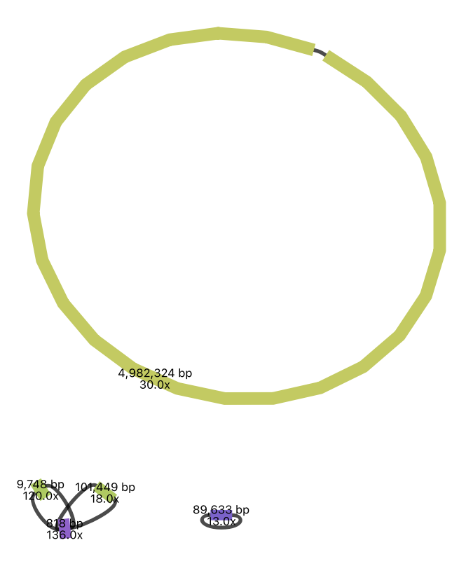

# Long-read Genome Assembly
{:.no_toc}

* TOC
{:toc}

# **1. Introduction**
In this practical, you will learn how to perform a *de novo* genome assembly using long-read ONT data from the same *Escherichia coli* isolate as in the short-read assembly practical.

## 1.1 Learning Outcomes
1. Learn how to perform a *de novo* genome assembly using long-read data
2. Learn about the differences between long- and short-read assemblies
3. Investigate the impact of sequencing depth


# **2. Setup**

## 2.1 Activate software
For today's practical, you will need to activate the `bioinf` conda environment:

```bash
source activate bioinf
```

## 2.2 Create directory structure
Let's create a new directory for today's practical and create subdirectories that reflect the main steps in our analysis. This will help us stay organised.
```bash
mkdir -p ~/Practical_assembly_long/{0_raw,1_assembly}
mkdir -p ~/Practical_assembly_long/1_assembly/quast
```

## 2.3 Get data
The data for today's practical is located in `~/data/assembly_long`. As in previous practicals, we will use symlinks instead of copying large data files.
```bash
# navigate to working directory
cd ~/Practical_assembly_long
# create a symlink for the ONT reads
ln -s ~/data/assembly_long/SRR36505805_30x.fastq.gz 0_raw/
```


# **3. Read Quality Control**
In this practical, you will be working with long-read whole-genome sequencing (WGS) data from a single isolate of *E. coli*, sequenced using Oxford Nanopore Technologies (ONT).
Normally, we would start with read quality control. However, quality control of long sequence reads is a little more complicated than for Illumina reads, and is outside the scope of this course.
Therefore, we will jump straight into performing genome assembly.

# **4. Perform Assembly**
Today we will be using the long-read assembler [Flye](https://github.com/mikolmogorov/Flye).

Flye help:
```bash
flye --help
```

Here is the command for running our Flye Assembly:
```bash
flye --nano-hq 0_raw/SRR36505805_30x.fastq.gz -t 2 -g 5m -o 1_assembly/SRR36505805
```
Make sure you understand what all the parameters mean. This will take ~15 minutes to run.

# **5. Investigate Assembly**
Let's take a look at the output files produced by `flye`:
```bash
ls 1_assembly/SRR36505805
```
The most important file is `assembly.fasta`. This contains the assembled contigs. Other files that may be of interest are `flye.log`, which contains logging information similar to what was printed to your terminal while `flye` was running, `assembly_graph.gfa`, which contains information about the assembly graph, and `assembly_info.txt`, which contains some summary information about the assembly.

Let's take a look at the `assembly_info.txt` file:
```bash
cat 1_assembly/SRR36505805/assembly_info.txt
```
The first four columns provide information for each contig on:
1. The name of the contig
2. The length of the contig
3. The coverage of the contig
4. Whether or not the contig is circular

Questions:
- How many contigs are there in the assembly?
- What is the length of the longest contig?
- Is the chromosome complete (i.e. assembled into a single circular contig)?

## 5.1 Summarising assembly metrics using QUAST
Run `quast` as in the previous practical and view the QUAST report.

Question:
- Does this provide you with any new information?

## 5.2 Visualise assembly graph
If you have Bandage installed, download the assembly graph file and view it in Bandage.

You should see something like this:


As you can see, the long reads have enabled the chromosome to be assembled into a single, circular contig.

Question:
- How do you interpret the additional contigs at the bottom of the figure?


# **6. The Impact of Sequencing Depth**
In section 5, you saw that the coverage of your ONT data is ~30x.

In this section, you will explore the effect of sequencing depth on assembly quality.

We have provided you with subsampled read sets corresponding to 1x, 2x, 5x and 10x coverage.
The following command will create symlinks to these subsampled read sets in `0_raw/` 
```bash
ln -s ~/data/assembly_long/SRR36505805_*x.fastq.gz 0_raw/
```
The file names should be self-explanatory. If you are confused, please ask for help.

## 6.1 Running multiple assemblies
Write and execute a script to run a `flye` assembly for each of the subsampled read sets. Don't forget to give each assembly a different output directory so you don't overwrite previous files.

## 6.2 Investigating assembly metrics
We will run `quast` to investigate the assembly metrics for the different subsampled read sets. We can run them all together in a single command as follows:
```bash
quast -t 2 -o 1_assembly/quast/SRR36505805_coverage 1_assembly/SRR36505805_1x/assembly.fasta 1_assembly/SRR36505805_2x/assembly.fasta 1_assembly/SRR36505805_5x/assembly.fasta 1_assembly/SRR36505805_10x/assembly.fasta 1_assembly/SRR36505805/assembly.fasta
```

Questions:
- What is the total length of the 1x assembly? Does this make sense for an *E. coli* genome?
- What happens to the total length of the assembly as coverage increases?
- What happens to the number of contigs as coverage increases?
- What happens to N50 as coverage increases?

## 6.3 Visualising assembly graphs
If you have time and you have installed Bandage, have a look at each of the assembly graphs. What are the main differences you notice as coverage increases?
