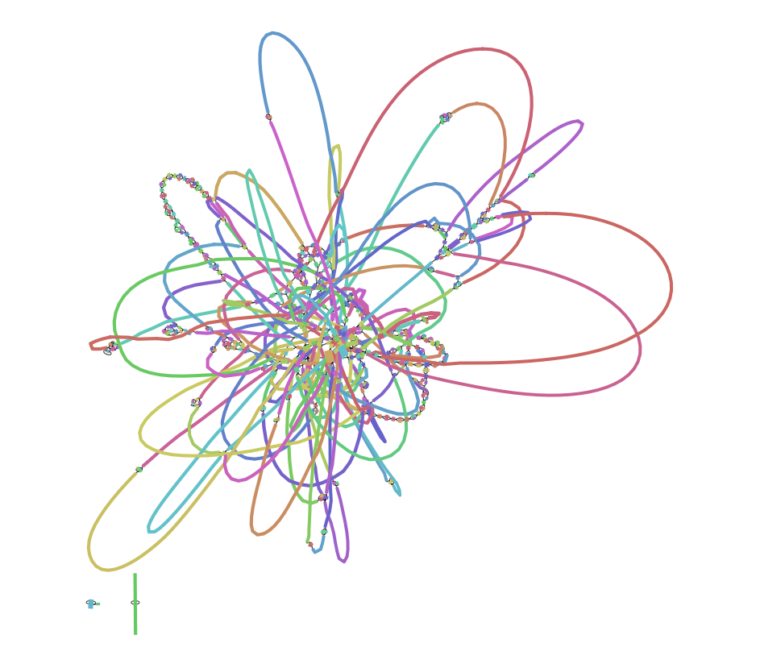
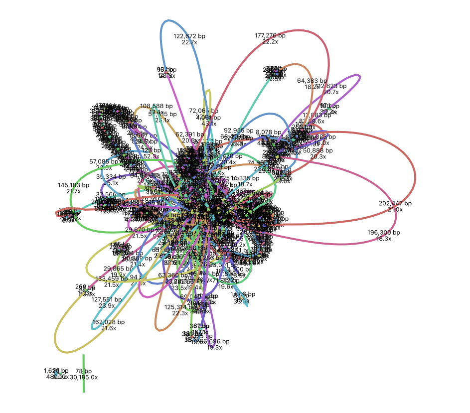

# Short-read Genome Assembly
{:.no_toc}

* TOC
{:toc}

# **1. Introduction**
In this practical, you will be performing a *de novo* genome assembly for a single *Escherichia coli* isolate using Illumina short-read whole-genome sequencing data.

## 1.1 Learning Outcomes
1. Learn how to perform a *de novo* bacterial genome assembly
2. Learn about assembly metrics and how to assess the quality of an assembly


# **2. Setup**

## 2.1 Activate software
For today's practical, you will need to activate the `bioinf` conda environment:

```bash
source activate bioinf
```

## 2.2 Create directory structure
Let's create a new directory for today's practical and create subdirectories that reflect the main steps in our analysis. This will help us stay organised.
```bash
mkdir -p ~/Practical_assembly_short/{0_raw,1_trim,2_assembly}
mkdir -p ~/Practical_assembly_short/0_raw/FastQC
mkdir -p ~/Practical_assembly_short/1_trim/{fastp,FastQC}
mkdir -p ~/Practical_assembly_short/2_assembly/quast
```

## 2.3 Get data
The data for today's practical is located in `~/data/assembly_short`. As in previous practicals, we will use symlinks instead of copying large data files.
```bash
# navigate to working directory
cd ~/Practical_assembly_short
# create symlinks for fastq files
ln -s ~/data/assembly_short/SRR36298124_[12].fastq.gz 0_raw/
```


# **3. Read Quality Control**

## 3.1 Trimming and FastQC
Based on what you've learned in previous practicals, write and execute a script called `run_qc.sh` to perform:
- FastQC on untrimmed Illumina reads (`SRR36298124_1.fastq.gz` and `SRR36298124_2.fastq.gz`)
- Read trimming using `fastp`
- FastQC on trimmed reads

Questions:
- What is the range of read lengths in the untrimmed reads? Is this what you expected? If not, can you think of a possible explanation?
- Are there any quality issues in the untrimmed reads that suggest trimming is necessary?
- What is the range of read lengths in the trimmed reads? Why is the minimum read length in the trimmed reads longer than in the untrimmed reads?
- What is the total number of bases present in the trimmed reads (forward and reverse combined)? Assuming a genome size of ~5 Mb, what coverage does this equate to?


# **4. Assembly**
We're going to be using a *de novo* assembler called [SPAdes](https://ablab.github.io/spades/), which employs a De Bruijn graph approach and is a **very** widely used assembler for bacterial genomes.
Accessing `spades` help:
```bash
spades --help
```

## 4.1 Running our first assembly
Here is a template for the command we will use to run `spades`. You will need to replace TRIM_1.FASTQ.GZ and TRIM_2.FASTQ.GZ with the actual paths to your trimmed reads from the Read Quality Control section above.
```bash
spades -t 2 -m 16 -1 TRIM_1.FASTQ.GZ -2 TRIM_2.FASTQ.GZ -o 2_assembly/SRR36298124
```
One you've entered the correct file paths, execute this command. Be patient, it will take ~20 minutes to run. You should see a lot of output printed to your terminal telling you about the steps that are being performed. If you think something doesn't look right, please call over a demonstrator.

Question:
- What is the effect of the -t, -m and -o parameters in the above command?


# **5. Investigating our assembly**
Let's take a look at the output files produced by `spades`:
```bash
ls 2_assembly/SRR36298124
```
The most important file is `contigs.fasta`. This contains the assembled contigs. Other files that may be of interest are `spades.log`, which contains logging information similar to what was printed to your terminal while `spades` was running, and `assembly_graph.fastg`, which contains information about the assembly graph.

Have a look at the contents of the `contigs.fasta` file:
```bash
less 2_assembly/SRR36298124/contigs.fasta
```

You may also wish to extract only the fasta headers:
```bash
grep "^>" 2_assembly/SRR36298124/contigs.fasta | less
```

We can also easily count the number of contigs using `grep`:
```bash
grep -c "^>" 2_assembly/SRR36298124/contigs.fasta
```

Questions:
- How many contigs are in the assembly?
- What is the length of the longest contig?
- What is the length of the shortest contig?

## 5.1 Summarising assembly metrics using QUAST
We will use the Quality Assessment Tool for Genome Assemblies ([QUAST](https://quast.sourceforge.net/)) for summarising assembly metrics.

For a simple version of the QUAST help, type `quast` and press enter. Alternatively, you can access the full help by typing `quast --help`, however this may be a little overwhelming.

You can run `quast` as follows:
```bash
quast -t 2 -o 2_assembly/quast/SRR36298124 2_assembly/SRR36298124/contigs.fasta
```
To view the QUAST report, navigate to the quast output directory in the files pane of RStudio, then click on `report.html` and select `View in Web Browser`.

Questions:
- What is the value of the "# contigs" metric? Is this the same as the number of contigs you identified using `grep` above? If not, can you think of a reason why? Hint: have a look at the simple `quast` help to understand the default parameters.
- What is the length of the largest contig? Is this the same as your answer from investigating the `fasta` file directly?
- What is the total length of the assembly? *E. coli* genomes range from 4.5-5.5 Mb. Is this assembly consistent with the expected genome size?
- What is the N50 for this assembly?
- What is the GC content of the assembly?

## 5.2 Visualising assembly graphs using Bandage
[Bandage](https://rrwick.github.io/Bandage/) is a tool for visualising assembly graphs. If you're working on your own computer, you can download and install Bandage if you wish, however you will not be able to do this if you are working on one of the computer suite machines.

If you do install Bandage, you can view your assembly graph as follows:
- From the files pane in RStudio, download the `assembly_graph.fastg` file
- Open Bandage and select `File`, `Load graph`, then select the `assembly_graph.fastg` file you have just downloaded
- Select `Draw graph`

You should see something like this:


Each coloured line represents a node in the assembly graph, with thin black lines representing edges that connect the different nodes. Notice that the majority of the contigs form a single "hairball" structure.

You can also add node labels to display more information. E.g. the following view shows length and depth labels.


You can see that the assembly graph is quite complicated! In the next practical you will have the opportunity to compare this with a long-read assembly graph.
